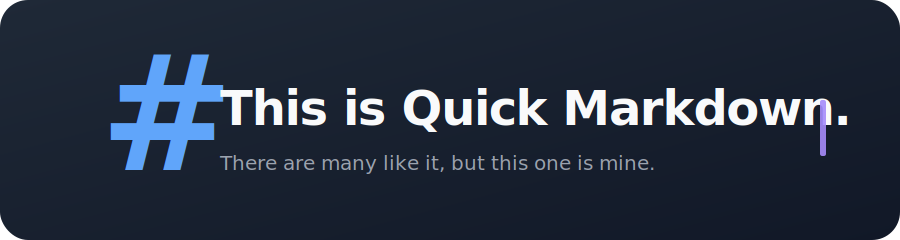
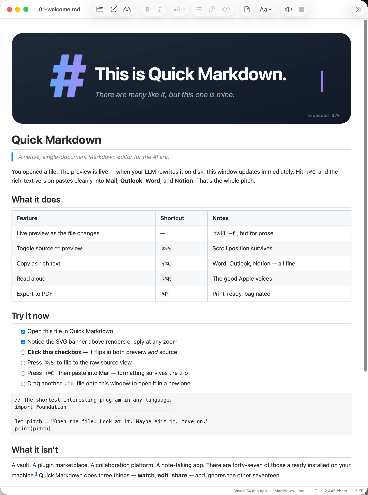
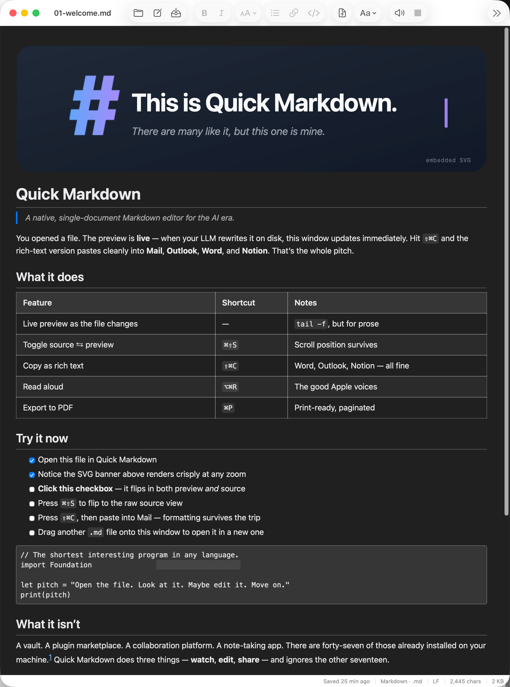
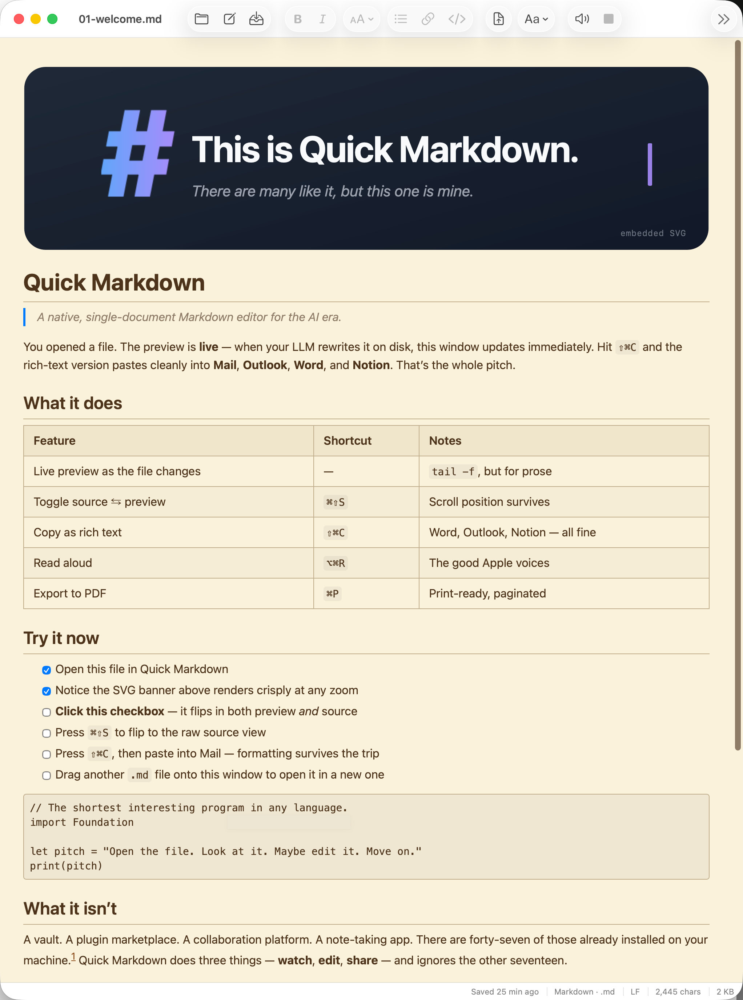
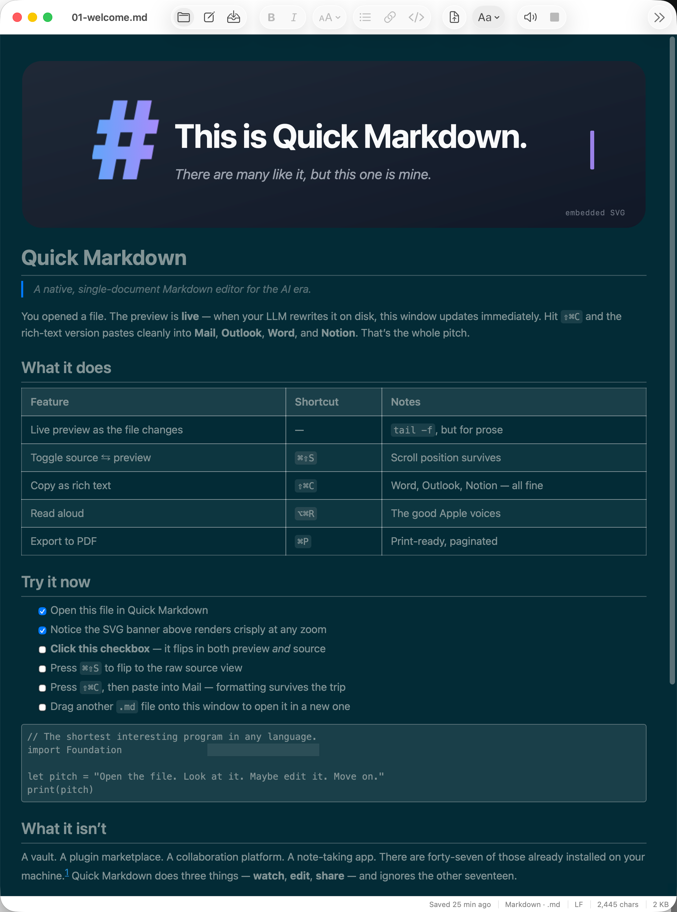
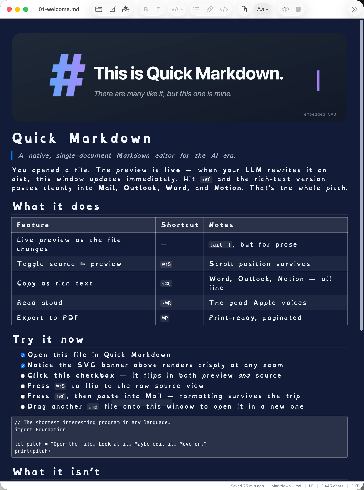

A focused, beautiful, native macOS Markdown editor for the AI era.

### [Download for macOS](https://github.com/Zesty0wl/quick-markdown/releases/latest)

Signed and notarized. App Sandbox. macOS 26 Tahoe and newer.

---

Your AI just wrote you a beautiful Markdown document. Now you need somewhere beautiful to read it, share it, and ship it.

Quick Markdown opens a `.md` file, makes it gorgeous, and gets out of the way. No vault. No workspace. No plugin marketplace. One file at a time.

---

## A personal tool, shared

I built Quick Markdown for me. I use it all day, every day, for reading what my LLMs write and for shipping Markdown into the apps I actually live in. It runs on macOS. There is no Windows version. There likely never will be. Suck it up, buttercup.

It's free, it's open source, it's MIT licensed. Fill your boots.

---

## What it does

- **Fast.** Pure Swift 6, AppKit, zero Electron. Opens instantly, scrolls smoothly, sips RAM.
- **Built for LLMs.** Point it at the file Claude Code, Copilot, or ChatGPT is writing. Watch the page rewrite itself in real time.
- **Real-time visual updates.** Edit the `.md` or a sibling SVG / PNG and the preview follows. No refresh button. Your scroll position survives.
- **Paste in from your LLM.** Select all and copy in Claude / ChatGPT / Gemini (`⌘A`, `⌘C`), then paste into Quick Markdown (`⌘V`). It strips the chat-app cruft and renders fresh Markdown.
- **Paste out as rich text anywhere.** `⇧⌘C` copies your document as HTML, RTF, and Markdown in one go. Outlook, Word, Notion, Confluence, Slack, Mail. It lands looking like it was authored there. `⇧⌘E` exports a signature-ready PDF.
- **Six themes, including dyslexia support.** Light, Dark, Sepia, Solarized, Night Sky, plus an OpenDyslexic-aware mode for accessible reading. Type sizes and fonts swap live.
- **Read aloud.** Built-in macOS text-to-speech with live source highlighting. Coffee, meet doc.
- **Signed and notarized.** Apple Developer ID, hardened runtime, App Sandbox. Gatekeeper opens it without a fuss.

---

## The gallery

| Light | Dark | Sepia |
|:-:|:-:|:-:|
|  |  |  |
| **Solarized** | **Night Sky** | **OpenDyslexic** |
|  |  |  |

---

## Keyboard cheat sheet

| Action | Shortcut | Action | Shortcut |
|---|---|---|---|
| Open file | `⌘O` | Copy as rich text | `⇧⌘C` |
| New file | `⌘N` | Export PDF | `⇧⌘E` |
| Save | `⌘S` | Read aloud | `⌥⌘R` |
| Toggle Preview / Source | `⇧⌘P` | Bold / Italic / Code | `⌘B` / `⌘I` / `⌘E` |
| Heading 1 / 2 / 3 | `⌥⌘1` / `⌥⌘2` / `⌥⌘3` | Link | `⌘K` |
| Insert Code Block | `⇧⌘K` | Insert Table | `⌥⌘T` |
| Realign Tables | `⌃⌥⌘T` | Toggle Task | `⇧⌘T` |

---

## Open source

MIT licensed. The source is yours. Read it, fork it, ship it.

* Contributing: see [`CONTRIBUTING.md`](CONTRIBUTING.md) for the design philosophy and how to send a PR.
* Security: found a vulnerability? Please follow [`SECURITY.md`](SECURITY.md) for private disclosure.
* Design notes: the full product rationale lives in [`QuickMarkdown_PRD.md`](QuickMarkdown_PRD.md).

---

## License

[MIT](LICENSE) © 2026 Neil Johnson

Built with [`swift-markdown`](https://github.com/apple/swift-markdown) (Apache 2.0). OpenDyslexic font, when installed, © Abelardo Gonzalez under [SIL Open Font License 1.1](https://opendyslexic.org/about).
