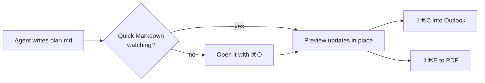
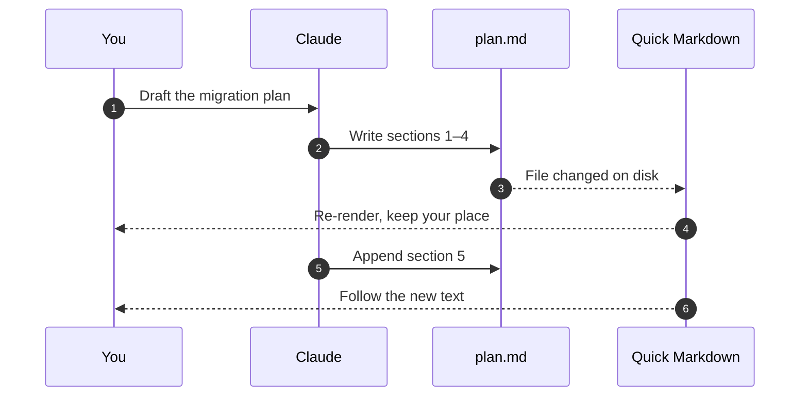
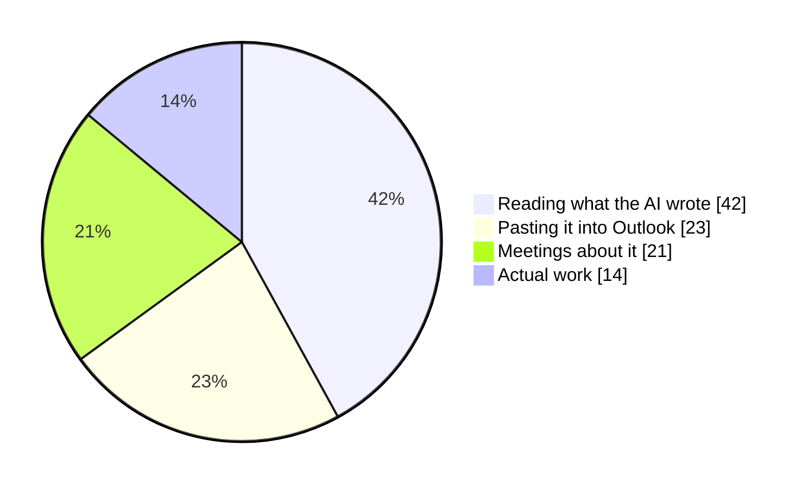

# Diagrams that draw themselves

Write a ` ```mermaid ` block and Quick Markdown draws it, offline, in colours that match your theme.


```mermaid
flowchart LR
    A[Agent writes plan.md] --> B{Quick Markdown<br/>watching?}
    B -- yes --> C[Preview updates in place]
    B -- no --> D[Open it with ⌘O]
    D --> C
    C --> E[⇧⌘C into Outlook]
    C --> F[⇧⌘E to PDF]
```

## Who talks to whom


```mermaid
sequenceDiagram
    autonumber
    participant You
    participant Claude
    participant File as plan.md
    participant QM as Quick Markdown
    You->>Claude: Draft the migration plan
    Claude->>File: Write sections 1–4
    File-->>QM: File changed on disk
    QM-->>You: Re-render, keep your place
    Claude->>File: Append section 5
    QM-->>You: Follow the new text
```

## Where the week went


```mermaid
pie showData
    "Reading what the AI wrote" : 42
    "Pasting it into Outlook" : 23
    "Meetings about it" : 21
    "Actual work" : 14
```
