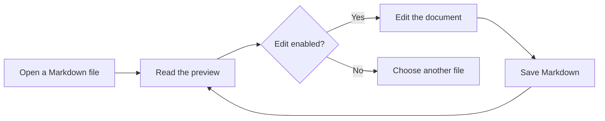
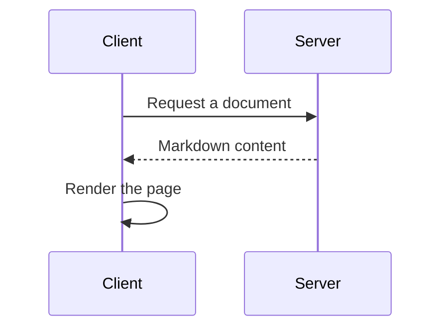
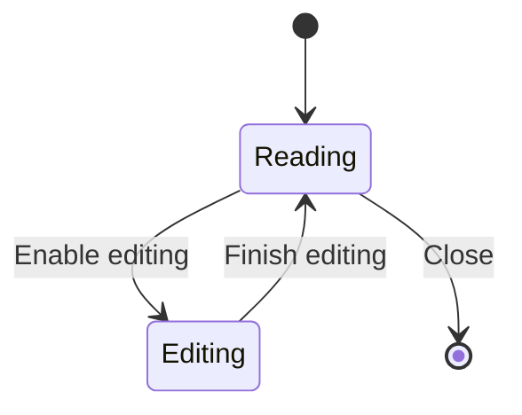

# Mermaid diagrams

## Document workflow

```mermaid
flowchart LR
    Open[Open a Markdown file] --> Read[Read the preview]
    Read --> Edit{Edit enabled?}
    Edit -->|Yes| Write[Edit the document]
    Edit -->|No| Browse[Choose another file]
    Write --> Save[Save Markdown]
    Save --> Read
```

## Request and response

```mermaid
sequenceDiagram
    participant Client
    participant Server
    Client->>Server: Request a document
    Server-->>Client: Markdown content
    Client->>Client: Render the page
```

Additional state diagram

```mermaid
stateDiagram-v2
    [*] --> Reading
    Reading --> Editing: Enable editing
    Editing --> Reading: Finish editing
    Reading --> [*]: Close
```

